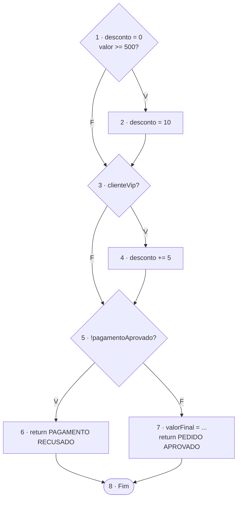
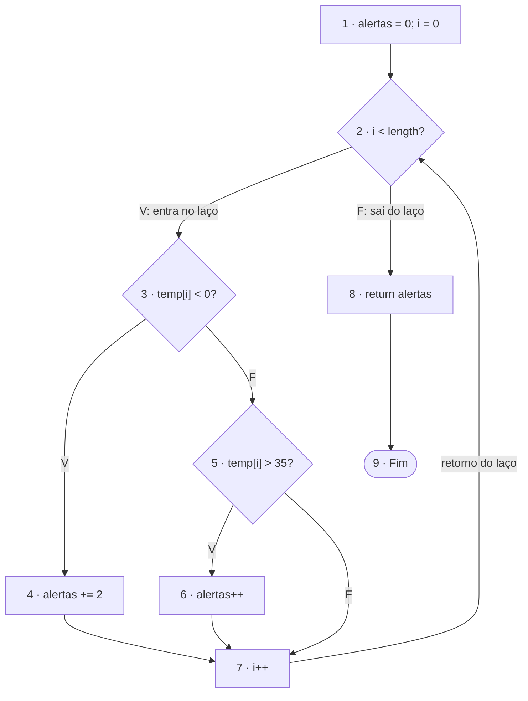

# Exercícios: Grafo de Fluxo de Controle

Convenção: o primeiro bloco é o início do fluxo e todo `return` leva ao nó **Fim**. V(G) = E − N + 2.

---

## Exercício 1: `classificarPedido`

### Blocos básicos

| Nó | Conteúdo |
|---|---|
| 1 | `desconto = 0;` e `if (valor >= 500)` (decisão D1, início) |
| 2 | `desconto = 10;` |
| 3 | `if (clienteVip)` (decisão D2) |
| 4 | `desconto += 5;` |
| 5 | `if (!pagamentoAprovado)` (decisão D3) |
| 6 | `return "PAGAMENTO RECUSADO";` |
| 7 | `valorFinal = ...;` e `return "PEDIDO APROVADO: " + valorFinal;` |
| 8 | Fim |

O código tem **3 decisões**: `valor >= 500`, `clienteVip` e `!pagamentoAprovado`.

### Grafo

O `return` do nó 6 encerra o método: o nó 6 vai direto ao Fim e não passa pelo nó 7.

### Complexidade ciclomática

- Arestas (10): 1→2, 1→3, 2→3, 3→4, 3→5, 4→5, 5→6, 5→7, 6→8, 7→8.
- N = 8 e E = 10.
- V(G) = E − N + 2 = 10 − 8 + 2 = **4**.
- Conferência: decisões + 1 = 3 + 1 = **4**. ✓

### Base de caminhos independentes

| Caminho | Nós | valor | clienteVip | pagamentoAprovado | Resultado esperado | Aresta nova |
|---|---|---|---|---|---|---|
| P1 | 1-3-5-7-8 | 100 | false | true | `PEDIDO APROVADO: 100.0` | base |
| P2 | 1-2-3-5-7-8 | 500 | false | true | `PEDIDO APROVADO: 450.0` | 1→2, 2→3 |
| P3 | 1-3-4-5-7-8 | 100 | true | true | `PEDIDO APROVADO: 95.0` | 3→4, 4→5 |
| P4 | 1-3-5-6-8 | 100 | false | false | `PAGAMENTO RECUSADO` | 5→6, 6→8 |

Cálculos: P2 dá desconto de 10% (500 − 50 = 450). P3 dá desconto de 5% (100 − 5 = 95).

### Discussão

1. **Combinações entre as três condições:** 2 × 2 × 2 = **8**. Como não há laço, são 8 caminhos distintos no grafo. Um exemplo fora da base: `valor = 500`, vip e pagamento aprovado dão desconto de 15%, ou seja, `PEDIDO APROVADO: 425.0`.
2. **É igual à complexidade ciclomática?** Não. V(G) = 4 é o tamanho da base de caminhos independentes, e o total de caminhos é 8. O total cresce por multiplicação (2³), e V(G) cresce por soma (3 + 1).
3. **Efeito do `return` na terceira condição:** ele cria uma segunda saída para o Fim. O ramo verdadeiro (nó 6) não volta ao fluxo principal e pula o cálculo do `valorFinal`. Sem esse `return`, os dois ramos se juntariam no nó 7.
4. **Calcular `valorFinal` sem pagamento aprovado?** Não. O nó 7 só é alcançado pela aresta 5→7, que exige `pagamentoAprovado = true`.

---

## Exercício 2: `contarAlertas`

### Blocos básicos

| Nó | Conteúdo |
|---|---|
| 1 | `alertas = 0; i = 0;` (início) |
| 2 | `while (i < temperaturas.length)` (decisão D1) |
| 3 | `if (temperaturas[i] < 0)` (decisão D2) |
| 4 | `alertas += 2;` |
| 5 | `else if (temperaturas[i] > 35)` (decisão D3) |
| 6 | `alertas++;` |
| 7 | `i++;` |
| 8 | `return alertas;` |
| 9 | Fim |

O código tem **3 decisões**: a condição do `while`, o `if` e o `else if`.

### Grafo

As três classificações são: negativa (nó 4), acima de 35 (nó 6) e entre 0 e 35 inclusive (aresta 5→7, sem alteração de `alertas`).

### Complexidade ciclomática

- Arestas (11): 1→2, 2→3, 2→8, 3→4, 3→5, 4→7, 5→6, 5→7, 6→7, 7→2, 8→9.
- N = 9 e E = 11.
- V(G) = E − N + 2 = 11 − 9 + 2 = **4**.
- Conferência: decisões + 1 = 3 + 1 = **4**. ✓

### Base de caminhos independentes

| Caminho | Nós | Vetor de entrada | Retorno | Aresta nova |
|---|---|---|---|---|
| P1 (sai sem iterar) | 1-2-8-9 | `{}` | 0 | 1→2, 2→8, 8→9 |
| P2 (negativa) | 1-2-3-4-7-2-8-9 | `{-5}` | 2 | 2→3, 3→4, 4→7, 7→2 |
| P3 (acima de 35) | 1-2-3-5-6-7-2-8-9 | `{40}` | 1 | 3→5, 5→6, 6→7 |
| P4 (entre 0 e 35) | 1-2-3-5-7-2-8-9 | `{20}` | 0 | 5→7 |

Vetores extras: `{0, 35}` retorna 0, e `{-5, 40, 20}` retorna 3 (2 + 1 + 0).

### Por que o retorno do laço aparece no CFG

A aresta 7→2 mostra que, depois do `i++`, a condição do `while` é avaliada de novo. Sem ela, o grafo pareceria processar só um elemento. Ela também entra na contagem: sem essa aresta, E = 10 e V(G) = 3, e a complexidade seria subestimada.

### Discussão

1. **Vários elementos: um caminho ou repetição?** Repete partes do grafo. Cada elemento faz uma volta (2 → 3 → ... → 7 → 2), escolhendo um dos três ramos a cada volta. Em `{-5, 40, 20}`, as voltas passam pelos nós 4, 6 e pela aresta 5→7.
2. **Sair sem acessar o vetor:** o vetor vazio `{}`. A condição `0 < 0` é falsa na primeira avaliação, e o fluxo vai direto do nó 2 ao 8.
3. **Fronteiras dos valores 0 e 35:** 0 testa a fronteira de `< 0` (0 não é negativo e não gera alerta). 35 testa a fronteira de `> 35` (35 não gera alerta). Os valores vizinhos (−0,1 e 35,1) mostram o outro lado.
4. **Por que o `else if` é uma nova decisão:** ele só é avaliado quando `< 0` é falso e tem suas próprias saídas verdadeira e falsa. É isso que cria a terceira classificação (nó 6) e soma 1 em V(G).

---

## Conferência final

- Cada sequência sem desvio está em um único bloco.
- Cada decisão tem as saídas V e F, e todos os `return` chegam ao Fim.
- Todos os nós são alcançáveis, e o laço do exercício 2 tem aresta de retorno.
- V(G) = E − N + 2 coincide com decisões + 1 nos dois exercícios (4 e 4).
- Cada caminho da base acrescenta ao menos uma aresta nova e tem dados de teste.
