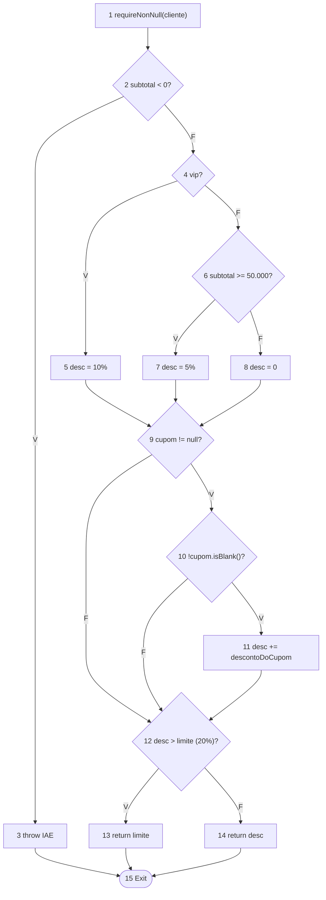
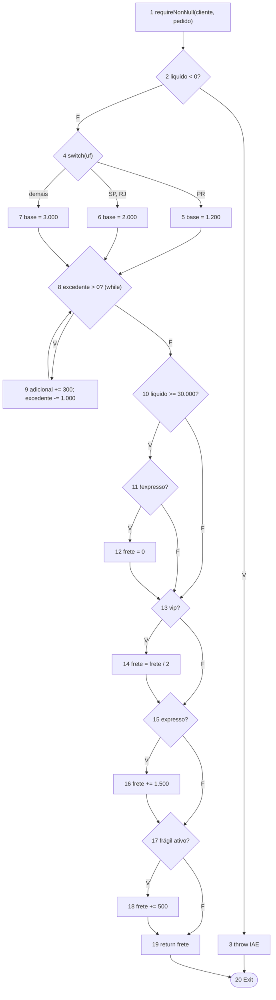
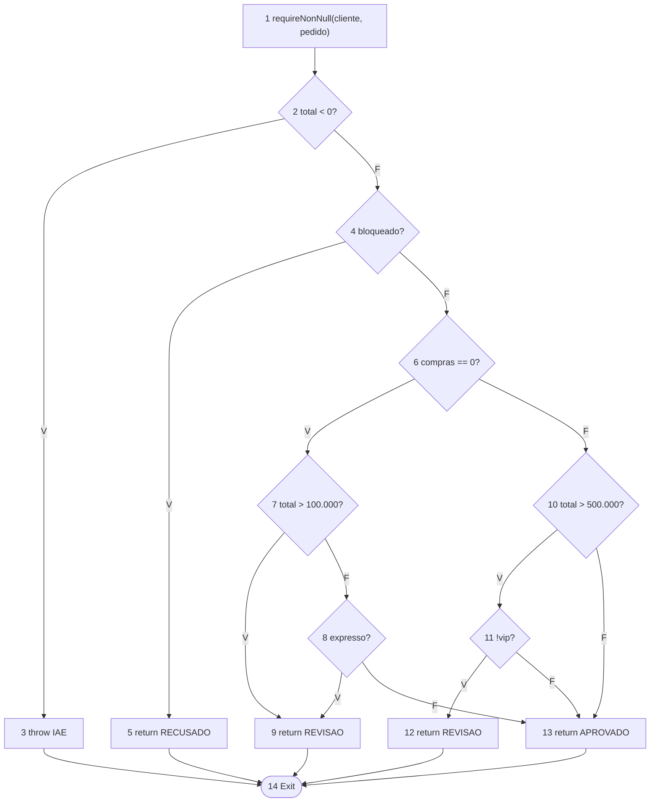
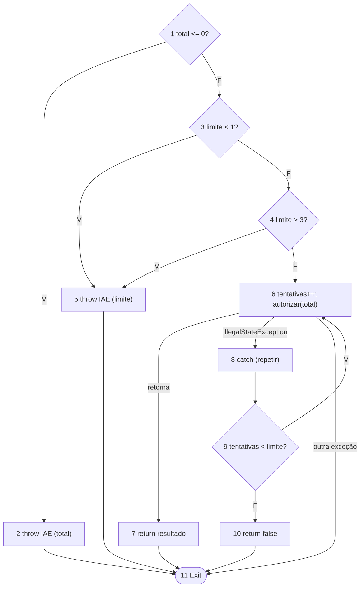
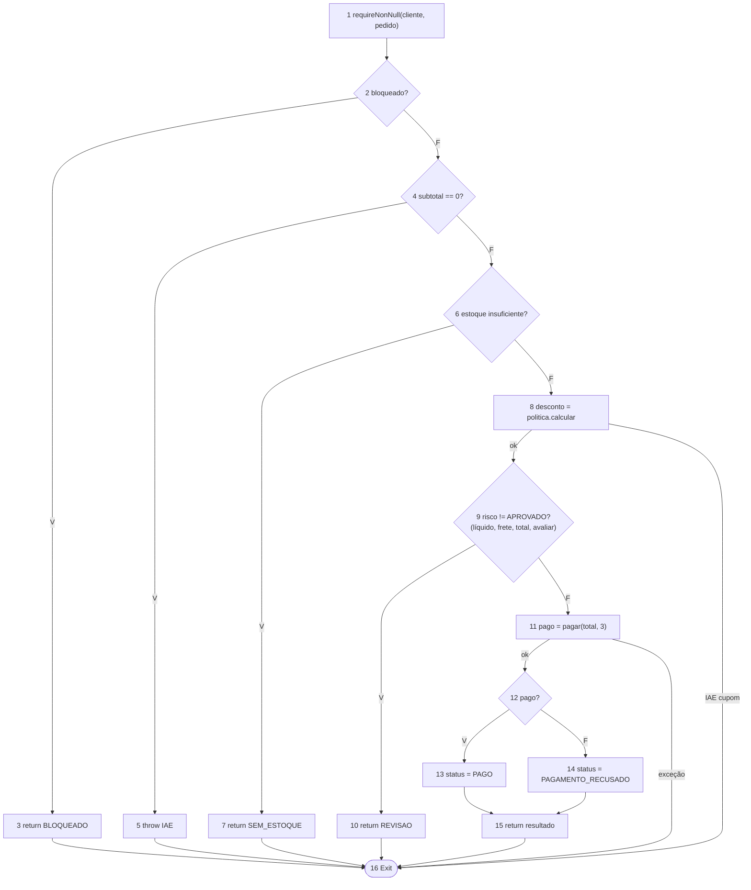

# Relatório: Teste Estrutural na Central de Pedidos

Projeto Java 17, Maven, JUnit 5 e JaCoCo. Os valores em dinheiro estão em centavos.

## 1. Resultado da cobertura

Relatório gerado com `mvn clean test` (`target/site/jacoco/index.html`).

| Contador | Perdidos | Total | Cobertura |
|---|---|---|---|
| Instruções | 0 | 753 | 100% |
| Branches | 0 | 120 | 100% |
| Linhas | 0 | 159 | 100% |
| Métodos | 0 | 25 | 100% |
| Classes | 0 | 11 | 100% |

Como a cobertura evoluiu:

1. Só o teste de exemplo: 69% das instruções e 44% dos branches.
2. Com os testes de cada classe: 95% e 95%. Só faltava o `PedidoService`.
3. Com os testes do `PedidoService`: 100% e 100%.

100% mostra que o código foi **executado**. Quem confere se o resultado está **correto** são as asserções.

## 2. Como as classes se relacionam

- `PedidoService.fechar` recebe um `Cliente` e um `Pedido` (que tem vários `ItemPedido`) e devolve um `ResultadoFechamento` com um `StatusPedido`.
- Para isso, chama nesta ordem: `PoliticaDesconto` (desconto), `CalculadoraFrete` (frete), `AnaliseRisco` (risco) e `PagamentoService` (cobrança).
- O `PagamentoService` chama o `ProcessadorPagamento`, que nos testes é substituído por um stub.

## 3. Grafos de fluxo (CFG) e complexidade de McCabe

Regras usadas nos grafos:

- Cada condição (inclusive cada parte de um `&&` ou `||`) é um nó separado.
- Todos os `return` e `throw` chegam a um único nó de saída (`Exit`).
- V(G) = E − N + 2 (E = arestas, N = nós). O valor bate com "número de decisões + 1".
- No `pagar` e no `fechar`, a exceção propagada também é uma aresta até a saída.

| Método | Nós (N) | Arestas (E) | V(G) |
|---|---|---|---|
| `PoliticaDesconto.calcular` | 15 | 20 | 7 |
| `CalculadoraFrete.calcular` | 20 | 28 | 10 |
| `AnaliseRisco.avaliar` | 14 | 20 | 8 |
| `PagamentoService.pagar` | 11 | 16 | 7 |
| `PedidoService.fechar` | 16 | 22 | 8 |

Em cada método, a **base de caminhos independentes** tem V(G) caminhos, cada um com os dados que o executam.

### 3.1 `PoliticaDesconto.calcular`


| Caminho | Dados | Resultado |
|---|---|---|
| 1-2-4-6-8-9-12-14-15 | comum, subtotal 49.999, sem cupom | desconto 0 |
| 1-2-3-15 | subtotal −1 | exceção |
| 1-2-4-5-9-12-14-15 | vip, 10.000 | 1.000 |
| 1-2-4-6-7-9-12-14-15 | comum, 50.000 | 2.500 |
| 1-2-4-6-8-9-10-11-12-14-15 | comum sem compras, 10.000, cupom `BEMVINDO` | 2.000 |
| 1-2-4-6-8-9-10-12-14-15 | comum, 60.000, cupom em branco | 3.000 |
| 1-2-4-5-9-10-11-12-13-15 | vip sem compras, 10.000, `BEMVINDO` (passa de 20%) | 2.000 |

### 3.2 `CalculadoraFrete.calcular`


| Caminho | Dados | Resultado |
|---|---|---|
| 1-2-4-5-8-10-13-15-17-19-20 | comum, PR, 1.000 g, líquido 10.000, sem frágil | 1.200 |
| 1-2-3-20 | líquido −1 | exceção |
| 1-2-4-6-8-10-13-15-17-19-20 | SP | 2.000 |
| 1-2-4-7-8-10-13-15-17-19-20 | MG | 3.000 |
| 1-2-4-5-8-9-8-10-13-15-17-19-20 | PR, 2.001 g (uma volta no laço) | 1.500 |
| 1-2-4-5-8-10-11-12-13-15-17-19-20 | líquido 30.000, entrega normal | 0 (frete grátis) |
| 1-2-4-5-8-10-11-13-15-16-17-19-20 | líquido 30.000, entrega expressa | 2.700 |
| 1-2-4-5-8-10-13-14-15-17-19-20 | vip, PR | 600 |
| 1-2-4-5-8-10-13-15-16-17-19-20 | expresso, líquido 10.000 | 2.700 |
| 1-2-4-5-8-10-13-15-17-18-19-20 | item frágil | 1.700 |

### 3.3 `AnaliseRisco.avaliar`


| Caminho | Dados | Resultado |
|---|---|---|
| 1-2-4-6-10-13-14 | com compras, total 500.000 | APROVADO |
| 1-2-3-14 | total −1 | exceção |
| 1-2-4-5-14 | cliente bloqueado | RECUSADO |
| 1-2-4-6-7-8-13-14 | sem compras, total 100.000, normal | APROVADO |
| 1-2-4-6-7-9-14 | sem compras, total 100.001 | REVISAO |
| 1-2-4-6-7-8-9-14 | sem compras, total 1.000, expresso | REVISAO |
| 1-2-4-6-10-11-12-14 | com compras, total 500.001, não vip | REVISAO |
| 1-2-4-6-10-11-13-14 | com compras, total 500.001, vip | APROVADO |

### 3.4 `PagamentoService.pagar`


| Caminho | Dados (stub do processador) | Resultado |
|---|---|---|
| 1-3-4-6-7-11 | aprova na 1ª chamada | `true`, 1 chamada |
| 1-2-11 | total 0 | exceção |
| 1-3-5-11 | limite 0 | exceção |
| 1-3-4-5-11 | limite 4 | exceção |
| 1-3-4-6-8-9-6-7-11 | indisponível, depois aprova | `true`, 2 chamadas |
| 1-3-4-6-8-9-10-11 | limite 1 e indisponível | `false`, 1 chamada |
| 1-3-4-6-11 | processador lança outra exceção | exceção propaga |

### 3.5 `PedidoService.fechar`


| Caminho | Dados | Resultado |
|---|---|---|
| 1-2-4-6-8-9-11-12-13-15-16 | comum, item 10.000, PR, processador `true` | PAGO, total 11.200 |
| 1-2-3-16 | cliente bloqueado | BLOQUEADO, 0 chamadas |
| 1-2-4-5-16 | lista vazia | exceção |
| 1-2-4-6-7-16 | quantidade 3, estoque 2 | SEM_ESTOQUE, 0 chamadas |
| 1-2-4-6-8-16 | cupom desconhecido | exceção, 0 chamadas |
| 1-2-4-6-8-9-10-16 | sem compras, total 142.500 | REVISAO, 0 chamadas |
| 1-2-4-6-8-9-11-16 | processador lança exceção inesperada | exceção propaga |
| 1-2-4-6-8-9-11-12-14-15-16 | processador `false` | PAGAMENTO_RECUSADO |

## 4. Caminhos inviáveis

Nenhuma regra foi alterada para forçar esses caminhos.

1. **Frete grátis com entrega expressa** (`CalculadoraFrete`): o frete só zera se a entrega for normal, então não há como zerar e cobrar o expresso ao mesmo tempo.
2. **`RECUSADO` da `AnaliseRisco` pelo `PedidoService`:** o serviço já retornou `BLOQUEADO` antes da análise. Esse caminho só é testado direto na classe.
3. **Validações de argumentos** (total ≤ 0, limite fora de 1 a 3, valores negativos): pelo serviço esses valores nunca chegam. Ficam cobertas pelos testes de cada classe.

## 5. Matriz de recursos

| Recurso | Como foi coberto |
|---|---|
| Linhas, métodos e classes | 100%, incluindo construtores e o método auxiliar `descontoDoCupom`. |
| Branches | 120 de 120: cada `if`, `switch` e o teto de 20% têm o lado verdadeiro e o falso. |
| Curto-circuito (`&&`, `||`) | Cada parte da condição foi testada sozinha, por exemplo: total alto, expresso e nenhum dos dois (risco sem compras); líquido baixo, expresso e frete grátis. |
| Decisões independentes (frete) | Das 12 combinações de gratuidade, VIP, expresso e frágil, todas têm teste. |
| `for`, `continue`, `break` (`Pedido`) | Lista vazia, uma e várias linhas; linhas inativas; falta de estoque na primeira e na última linha. |
| `while` (peso do frete) | Zero, uma e várias voltas; quilo exato e fração de quilo. |
| `do/while` e `try/catch` (pagamento) | Uma tentativa, várias, esgotamento das 3 e exceção inesperada. |
| Retornos antecipados | Bloqueado, sem itens e sem estoque terminam antes do pagamento, e o stub confirma 0 chamadas. |
| Stub do processador | Guarda a ordem das respostas, o número de chamadas e o valor recebido. |
| Limites e entradas inválidas | Abaixo, igual e acima de cada limite; cupom com espaços e minúsculas; centavos truncados; cópia da lista. |

## 6. Alteração proposital

Alterei uma regra de cada vez, vi os testes falharem e desfiz a alteração.

| Alteração | Teste que falhou |
|---|---|
| Desconto: `subtotal >= 50_000` virou `> 50_000` | `clienteComumRecebeCincoPorCentoAPartirDeQuinhentosReais` (linha 50000) |
| Frete: `liquido >= 30_000` virou `> 30_000` | `liquidoDeTrezentosReaisZeraOFrete` e outros 4 |
| Pagamento: `catch (IllegalStateException)` virou `catch (RuntimeException)` | `outraExcecaoNaPrimeiraTentativaPropagaSemRepetir` e outros 2 |

## 7. Discussões

**Cobertura de ramos não é cobertura de caminhos.** No fim do frete há quatro decisões em sequência (gratuidade, VIP, expresso e frágil). Três testes já cobrem todos os branches, mas só 2 das 12 combinações possíveis. Um erro que depende da combinação passaria: se o expresso (R$ 15,00) fosse somado antes da metade do VIP, um cliente VIP com entrega expressa pagaria 1.350 em vez de 2.100, e o JaCoCo continuaria em 100%. Por isso foram escritos os testes de combinação, além da meta de cobertura.

**Exceção que o contador de branches não mostra.** O `catch` do `PagamentoService` e a propagação de outras exceções não são branches para o JaCoCo. Trocar `catch (IllegalStateException)` por `catch (RuntimeException)` não muda nenhum número da cobertura, mas faz o sistema engolir erros que deveriam parar o fechamento. Só os testes de propagação de exceção (`outraExcecao...Propaga`) detectam isso.

## 8. Como rodar

```
cd aulas/SEMANA06/central-pedidos
mvn clean test
```

Abrir `target/site/jacoco/index.html`.
